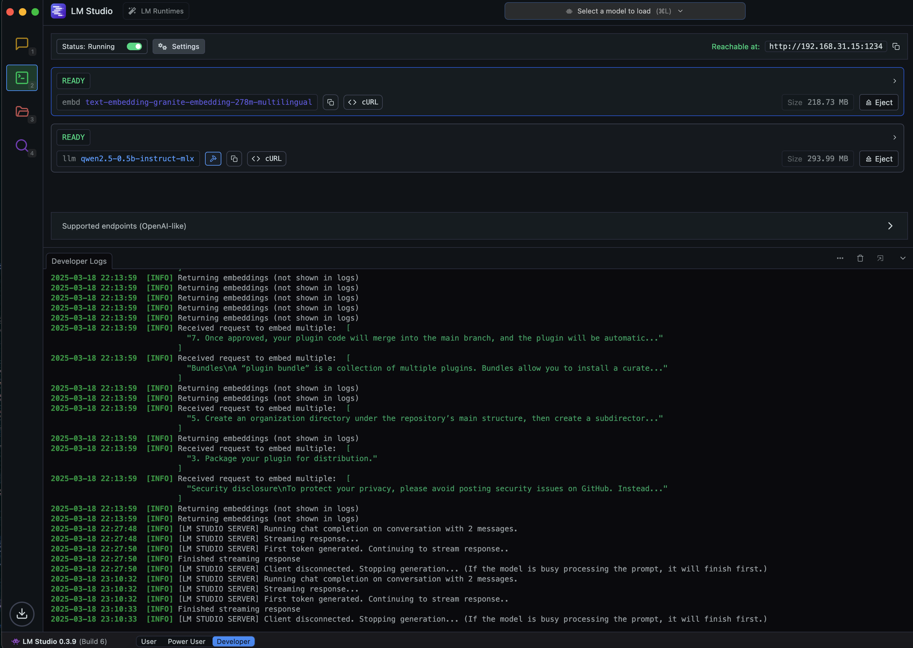
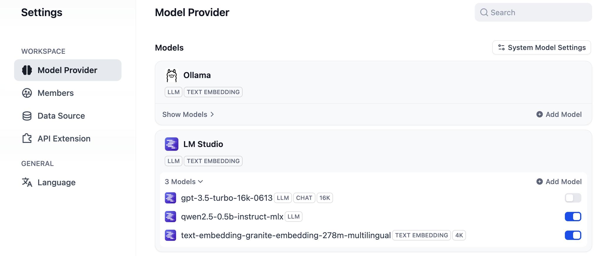
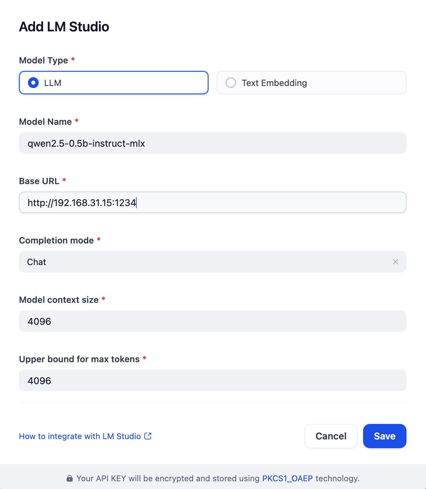
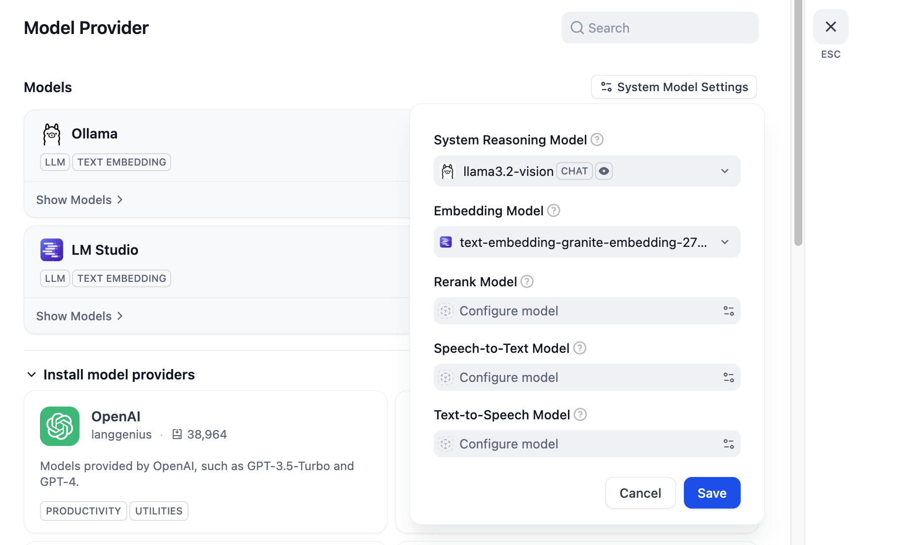

# LM Studio Plugin for Dify

**Author:** [Steven Lynn](https://github.com/stvlynn)

**Version:** 0.0.1

**Type:** model

**Repository:** https://github.com/stvlynn/lmstudio-Dify-Plugin

---

This plugin allows you to connect your LM Studio local models to Dify.

## Features

- Support for both Chat and Completion models
- Support text embedding models

## Setup

### LM Studio
1. Install [LM Studio](https://lmstudio.ai/) on your computer
2. Run LM Studio and load a local model

3. Configure LM Studio to serve the model via API (in server mode)
4. Configure the plugin with your LM Studio server URL (default is http://localhost:1234)

### Models

1. Install [LM Studio](https://https://marketplace.dify.ai/plugins/stvlynn/lmstudio) from Dify Marketplace.
2. Set up models in **Model Provider** -> **LM Studio** -> **Add Model**

3. Add a model.

4. If you added an embedding model, apply it in **Model Provider** -> **System Model Setting** -> **embedding Model**

## Requirements

- LM Studio running with at least one model loaded
- API server mode enabled in LM Studio

## Usage

After setting up the plugin, you can use any loaded LM Studio model in your Dify applications by selecting it in the model dropdown.

## License

[MIT](./LICENSE)

